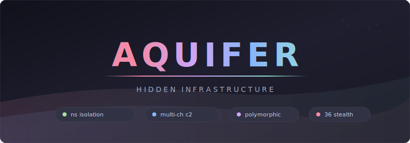

<div align="center">

<picture>
  <source media="(prefers-color-scheme: dark)" srcset="assets/banner.svg">
  <source media="(prefers-color-scheme: light)" srcset="assets/banner.svg">
  
</picture>

<br>

**Linux post-exploitation framework using kernel namespace isolation**

[](https://go.dev)
[](https://kernel.org)
[](.)

Kernel namespace isolation turns the OS against its own defenses. Multi-channel C2 with polymorphic beacons keeps traffic invisible. 36 stealth modules handle the rest.

> **For authorized security testing only.** Requires signed Rules of Engagement.

</div>

---

## Table of Contents

- [Highlights](#highlights)
- [Quick Start](#quick-start)
- [Execution Flow](#execution-flow)
- [C2 Transport](#c2-transport)
- [C2 Server](#c2-server)
- [Stealth Modules](#stealth-modules)
- [Evasion](#evasion)
- [OPSEC](#opsec)
- [Advanced Persistence](#advanced-persistence)
- [Wire Protocol](#wire-protocol)
- [Architecture](#architecture)
- [Configuration](#configuration)
- [Testing](#testing)

---

## Highlights

<table>
<tr>
<td width="50%">

### Namespace Isolation

PID, Mount, Network, UTS, and Cgroup namespace isolation with veth pair routing and NAT masquerade. The implant operates in its own kernel-enforced sandbox with DNAT loopback routing for host connectivity.

</td>
<td width="50%">

### Multi-Channel C2

HTTPS primary with domain fronting. DNS tunneling fallback via TXT records. DNS-over-HTTPS for restrictive networks. Raw Layer 2 Ethernet frames below netfilter/iptables for environments where everything else fails.

</td>
</tr>
<tr>
<td width="50%">

### Polymorphic Beacons

18 rotating paths, 8 content-types, 13 user-agents, and randomized headers per cycle. JA3 fingerprint randomization per session. Traffic shaping mimics legitimate browsing patterns with cryptographic jitter.

</td>
<td width="50%">

### Memory Protection

`ProtectedConfig` encrypts C2 URLs and session keys at rest with XOR rekeying each cycle. `[]byte` API with deterministic shredding after use. `DisableKeepAlives` + `FlushConnections()` + `runtime.GC()` clears transient state.

</td>
</tr>
<tr>
<td width="50%">

### Process Masquerade

Kernel-level argv and `/proc/[pid]/comm` rewrite impersonating `accounts-daemon`. Direct `/proc/self/mem` zeroing of the environ region defeats `cat /proc/PID/environ`. `GOMAXPROCS(1)` reduces visible OS threads.

</td>
<td width="50%">

### 36 Stealth Modules

eBPF cloaking hides PIDs in BPF maps. `memfd_create` + `execveat` for fileless execution. Kernel keyring stores secrets invisible to userspace forensics. Anti-dump regions block LiME/AVML. `io_uring` shared ring buffers bypass syscall monitoring.

</td>
</tr>
<tr>
<td width="50%">

### Target Keying

Hostname, CIDR range, MAC address, machine ID, canary file, and kill date guardrails prevent lab escape. The implant auto-terminates and cleans up if any guardrail fails. No accidental detonation outside the target environment.

</td>
<td width="50%">

### Advanced Persistence

Systemd generators run before all units at boot. NSS modules trigger on any DNS or user lookup. Logrotate, DHCP, APT, and audit dispatcher hooks fire on routine system events. `binfmt_misc` and modprobe hooks cover the rest.

</td>
</tr>
</table>

---

## Quick Start

### Prerequisites

| Requirement | Version | Notes |
|-------------|---------|-------|
| Go | 1.21+ | 1.25+ for garble obfuscation |
| Platform | Linux | Kernel namespace support required |
| garble | latest | Optional, for obfuscated builds |
| UPX | latest | Optional, for release compression |
| Python | 3.9+ | For C2 server |

### Build

```bash
# Development build (stripped, static)
make build

# ARM64 cross-compile
make build-arm64

# Obfuscated build (requires garble)
make build-garble

# Production release (garble + UPX + signature patching)
make build-release

# Full CI check (vet + fmt + build)
make check
```

Output binaries are placed in `build/`.

### Verify

```bash
# Check for Go metadata leaks
make strings-check

# Compare regular vs garble builds
make gobuild-check

# Run OPSEC verification suite on release binary
make opsec-check
```

The OPSEC check verifies: no Go module paths in binary strings, no C2 URLs in plaintext, no Go runtime symbol references, UPX signatures fully scrubbed (via `scripts/patch_upx.py`), no Go section headers (gosymtab, gopclntab, go.buildinfo), and high binary entropy confirming compression/encryption.

---

## Execution Flow

### 1. Parent Stage

Runs pre-namespace checks before isolation:

- Target-keying guardrails (hostname, IP range, machine ID, canary file, kill date)
- Environment fingerprinting (VM/sandbox/debugger detection)
- EDR detection and behavioral adjustment
- OPSEC hardening (disable core dumps, anti-ptrace, process masquerade)

### 2. Namespace Bootstrap

Re-execs into isolated PID + Mount + Network + UTS + Cgroup namespaces with veth pair, NAT masquerade, and DNAT loopback routing for host connectivity. Parent sets up host-side veth pair, then waits for the child process.

Parent process handles SIGTERM/SIGINT: kills child, cleans up host-side network artifacts (veth, iptables, sysctl), removes cgroup directories, then exits. Normal child exit also triggers full host-side cleanup before the parent terminates.

### 3. Child Stage

Operational loop inside namespaces:

- Process hiding and memory protection
- ECDH key exchange with C2 server
- Beacon loop with jittered sleep and exponential backoff
- Task execution with encrypted result delivery
- Signal-driven graceful shutdown with full cleanup (network artifacts, cgroups, workspace, persistence)

---

## C2 Transport

| Channel | Description | Use Case |
|---------|-------------|----------|
| HTTPS | Primary channel with domain fronting support | Standard egress |
| DNS | TXT record exfiltration | Firewall bypass |
| DoH | DNS-over-HTTPS | Restrictive networks |
| Raw L2 | AF_PACKET raw Ethernet frames below netfilter/iptables | Below firewall inspection |

### Transport Features

| Feature | Description |
|---------|-------------|
| JA3 randomization | Unique TLS fingerprint per session |
| Traffic shaping | Mimics legitimate browsing patterns |
| Polymorphic intervals | Cryptographic jitter on beacon timing |
| Server-side overrides | Sleep and jitter tuning via `BeaconResponse` |
| Automatic failover | Cascading transport channel fallback |
| Deterministic routing | `X-Request-ID` header for O(1) session resolution |

---

## C2 Server

Python operator console for managing implants. Built with cmd2 + Rich using Catppuccin Mocha theme.

```bash
# Install dependencies
pip install -r c2server/requirements.txt

# Launch the operator console
python3 -m c2server --db c2.db --keys server_keys.pem
```

### Components

| Component | Description |
|-----------|-------------|
| ECDH P-256 | Persisted server key exchange matching Go implant protocol exactly |
| AES-256-GCM | Encrypted beacon traffic with traffic shaping |
| HTTPS listener | Starlette + uvicorn with TLS 1.2+ hardening, O(1) session lookup via X-Request-ID |
| DNS listener | TXT record C2 with base32 encoding and response truncation |
| Polymorphic routing | 18 rotating beacon paths + default path |
| SQLite backend | Sessions, tasks, results, loot, listeners (WAL mode, per-thread connections) |
| Rich CLI | Catppuccin Mocha themed tables, panels, and status display |
| Context switching | Main context (sessions/listeners/loot) and implant context (shell/upload/persist/etc) |

### Operator Commands

**Main context:** `sessions`, `interact`, `listeners`, `loot`, `generate`

**Implant context:** `shell`, `upload`, `download`, `ls`, `ps`, `netstat`, `ifconfig`, `whoami`, `sysinfo`, `persist`, `cleanup`, `sleep`, `kill`, `info`, `tasks`, `results`, `back`

---

## Stealth Modules

36 modules for deep host-level blending (`pkg/stealth/`):

| Module | File | Description |
|--------|------|-------------|
| Argv masquerade | `process_blend.go` | Full `/proc/[pid]` profile mimicry (FDs, CWD, OOM score) |
| Process genealogy | `genealogy.go` | Double-fork re-parenting to PID 1 |
| PID manipulation | `pid_manip.go` | Fork-burn PIDs inside PID namespace to avoid PID 1 |
| PID recycling defense | `pid_recycle.go` | Land in dense PID regions matching system services |
| eBPF cloaking | `ebpf_cloak.go` | BPF map-based PID hide list (stub filter, map functional) |
| Environment cloning | `env_clone.go` | Clone env vars from live target process |
| Network blending | `network_blend.go` | Fake connections and service banner responders |
| Decoy processes | `decoy.go` | Spawn and manage decoy service processes |
| History obfuscation | `history.go` | Shell history manipulation and RC file injection |
| Cgroup camouflage | `cgroup_camo.go` | Mimic systemd service cgroup hierarchy |
| Namespace hiding | `ns_hide.go` | Container ID spoofing and namespace obfuscation |
| Nested namespaces | `ns_layers.go` | Outer decoy + inner operational namespace |
| Group blending | `group_blend.go` | Match supplementary groups of target service |
| Capability management | `capabilities.go` | Ambient capability escalation |
| Syscall proxying | `syscall_proxy.go` | Ptrace-based syscall injection into target processes |
| Memory spoofing | `mem_spoof.go` | `/proc/[pid]/maps` region name spoofing via PR_SET_VMA |
| TCP/IP fingerprinting | `tcpip_spoof.go` | Kernel TCP stack parameter spoofing |
| D-Bus blending | `dbus_blend.go` | Register as legitimate D-Bus service |
| lsof misdirection | `lsof_spoof.go` | FD spoofing via bind mounts |
| Benign strings | `benign_strings.go` | Inject legitimate-looking strings into binary |
| Seccomp awareness | `seccomp_aware.go` | Detect seccomp filters and adapt syscall behavior |
| Socket inheritance | `socket_inherit.go` | Inherit sockets from target service for blending |
| Timestamp freezing | `ts_freeze.go` | tmpfs timestamp manipulation for anti-forensics |
| Polymorphic engine | `polymorphic.go` | XOR-encrypt data regions when analysis detected |
| Exe link spoofing | `exe_spoof.go` | `/proc/self/exe` manipulation via PR_SET_MM_EXE_FILE |
| Seccomp forensic block | `seccomp_notif.go` | BPF filter blocks ptrace/perf_event/process_vm_readv |
| Kernel keyring storage | `keyring_store.go` | Store secrets in kernel memory (invisible to memory forensics) |
| io_uring covert I/O | `iouring.go` | Shared ring buffer I/O bypassing syscall-level monitoring |
| Anti-dump regions | `antidump.go` | MADV_DONTDUMP and MADV_WIPEONFORK memory protection |
| Cross-process injection | `vmwrite_inject.go` | process_vm_writev shellcode injection without ptrace |
| Userfaultfd decoy | `uffd_decoy.go` | Serve fake memory pages to forensic tools via page fault handler |
| Kernel tunable manipulation | `ktune.go` | Disable kprobes, ftrace, perf via /proc/sys and /sys/kernel |
| Abstract unix sockets | `abstract_sock.go` | Filesystem-free IPC via abstract namespace sockets |
| Fileless execution | `memfd_exec.go` | memfd_create + execveat for diskless ELF execution |
| eBPF program pinning | `bpf_pin.go` | Persistent kernel hooks via bpffs that survive process death |
| Landlock self-sandboxing | `landlock_cage.go` | Unprivileged Landlock LSM profiles for camouflage |

---

## Evasion

- VM/sandbox detection (hypervisor, timing, MAC OUI, BIOS strings)
- EDR product detection with behavioral adaptation
- Auditd rule parsing and syscall avoidance
- Namespace intrusion detection (nsenter monitoring)
- Filesystem watch detection (inotify/fanotify/audit)
- `/proc` entry hiding and self-unlinking
- eBPF program detection and enumeration

---

## OPSEC

- **Guardrails** -- Target-keying prevents lab escape (hostname, CIDR, machine ID, canary, kill date)
- **Kill switch** -- Auto-cleanup on forensic tool detection or user login
- **Memory encryption** -- Session keys XOR-encrypted at rest, decrypted into short-lived buffers
- **Core dump prevention** -- RLIMIT_CORE=0 and PR_SET_DUMPABLE=0
- **Anti-ptrace** -- Blocks debugger attachment
- **Process masquerade** -- Kernel-level argv rewrite impersonating `accounts-daemon`
- **Environment scrubbing** -- `os.Clearenv()` + direct `/proc/self/mem` zeroing of environ region
- **Thread count reduction** -- `GOMAXPROCS(1)` minimizes OS threads visible in `/proc/PID/status`
- **I/O noise injection** -- Random procfs reads between beacon cycles break `/proc/PID/io` correlation
- **Heap protection** -- `ProtectedConfig` encrypts C2 URLs/keys at rest with XOR rekeying each cycle; `GetC2ServersBytes()` returns `[]byte` slices that callers shred after use; transport and config blobs destroyed on shutdown
- **Polymorphic beacons** -- 18 rotating paths, 8 content-types, 13 user-agents, randomized headers per cycle (applied to both beacon loop and initial registration)
- **Crypto hygiene** -- ECDH client public key shredded after registration; session key stack residue eliminated; rekey failure tracking with graceful shutdown after entropy exhaustion; bias-free `CryptoRandIntn` via rejection sampling
- **Memory-mapped loader** -- In-memory ELF execution without disk artifacts
- **Anti-forensics** -- Timestomping, binary self-deletion, full cleanup on exit
- **Kernel keyring** -- Secrets stored in kernel memory, invisible to userspace forensics
- **Anti-dump** -- MADV_DONTDUMP/WIPEONFORK prevents memory capture by LiME/AVML
- **NSS safety guard** -- Refuses to modify nsswitch.conf if the NSS .so doesn't exist on disk (prevents breaking host DNS)
- **Host-side cleanup** -- Removes veth interfaces, iptables rules, sysctl overrides, and cgroup directories on exit
- **Parent signal handler** -- SIGTERM/SIGINT caught by parent process to ensure host artifacts are cleaned even if parent is killed directly
- **Sysctl restoration** -- Removing sysctl.d persistence restores runtime kernel parameters (ptrace_scope, kptr_restrict, ftrace, BPF, perf) without requiring reboot

---

## Advanced Persistence

Beyond standard persistence (cron, systemd, init.d, bashrc), the framework includes advanced mechanisms:

| Method | Description |
|--------|-------------|
| Systemd generators | `/etc/systemd/system-generators/` -- runs before all units at boot |
| NSS modules | `/etc/nsswitch.conf` injection -- triggered by any DNS/user lookup |
| Logrotate hooks | `/etc/logrotate.d/` post-rotate scripts -- periodic execution |
| DHCP client hooks | `/etc/dhcp/dhclient-exit-hooks.d/` -- runs on network events |
| APT hooks | `/etc/apt/apt.conf.d/` -- executes on package operations |
| Audit dispatcher | `/etc/audit/plugins.d/` -- runs on audit events |
| binfmt_misc | `/etc/binfmt.d/` -- triggers on specific file execution |
| Modprobe hooks | `/etc/modprobe.d/` install commands -- runs on module load |
| NM dispatcher | `/etc/NetworkManager/dispatcher.d/` -- runs on network state changes |
| Sysctl.d | `/etc/sysctl.d/` -- kernel tunables applied at boot (disables tracing/debugging) |

---

## Wire Protocol

The Go implant and Python C2 server communicate via JSON-encoded, AES-256-GCM encrypted payloads.

| Field | Go JSON Tag | Python Key | Notes |
|-------|-------------|------------|-------|
| Sleep override | `json:"sleep"` | `"sleep"` | Seconds (int) |
| Jitter override | `json:"jitter"` | `"jitter"` | 0.0-1.0 (float64) |
| Task result ID | `json:"id"` | `"id"` | UUID string |
| Task result output | `json:"output"` | `"output"` | Go `[]byte` -> base64 in JSON, Python base64-decodes |
| Shutdown flag | `json:"shutdown"` | `"shutdown"` | Boolean |

CLI task arguments are serialized as `map[string]string` -- all values must be strings on the wire.

---

## Architecture

```
.
├── cmd/
│   ├── implant/main.go              Entry point (parent -> namespace child)
│   └── test-implant/main.go         Integration test implant (no namespaces)
├── pkg/
│   ├── c2/                          C2 transports
│   │   ├── dns.go                   DNS TXT record transport
│   │   ├── doh.go                   DNS-over-HTTPS transport
│   │   ├── fronting.go              Domain fronting
│   │   ├── https.go                 Primary HTTPS transport
│   │   ├── ja3.go                   JA3 fingerprint randomization
│   │   ├── polymorphic_beacon.go    Polymorphic beacon encoding
│   │   ├── protocol.go              Beacon encode/decode
│   │   ├── rawl2.go                 Raw Layer 2 Ethernet transport
│   │   ├── traffic_shape.go         Traffic pattern shaping
│   │   └── transport.go             Transport manager with failover
│   ├── config/config.go             Compile-time configuration
│   ├── evasion/                     Detection and evasion
│   ├── namespace/                   Linux namespace management
│   ├── opsec/                       Operational security
│   ├── stealth/                     36 stealth modules
│   ├── tasking/                     Task handler framework
│   └── version/                     Build version metadata
├── internal/
│   └── shared/                      Internal shared utilities
├── scripts/
│   ├── integration_test.sh          End-to-end C2 + implant test
│   └── patch_upx.py                 UPX signature scrubber
├── c2server/                        Python C2 operator console
│   ├── __main__.py                  Entry point
│   ├── crypto/                      ECDH, AES-GCM, traffic shaping
│   ├── protocol/                    Beacon encode/decode, polymorphic paths
│   ├── models/                      SQLite models (sessions, tasks, loot)
│   ├── listeners/                   HTTPS + DNS listeners
│   ├── cli/                         cmd2 app, Rich theme, commands
│   └── requirements.txt             Python dependencies
├── docs/                            Planning docs and landing page
│   └── index.html                   Project landing page
├── Makefile                         Build targets
├── Dockerfile                       Container build
├── go.mod
└── go.sum
```

### Key Patterns

| Pattern | Implementation |
|---------|----------------|
| Two-stage execution | Parent runs checks, re-execs into namespace child |
| Compile-time config | All settings baked via `-ldflags`, no runtime config files |
| Transport failover | HTTPS -> DNS -> DoH -> Raw L2 cascade |
| Memory-first | `ProtectedConfig`, `[]byte` APIs, deterministic shredding |
| Kernel-level hiding | Namespace isolation + eBPF cloaking + procfs manipulation |

---

## Configuration

All configuration is compile-time via `pkg/config/config.go`. Override defaults with `-ldflags` at build time:

| Field | Default | Description |
|-------|---------|-------------|
| `C2Servers` | `https://127.0.0.1:8443/api/v1/beacon` | Primary HTTPS endpoints |
| `DNSDomains` | `ns1.example.com` | DNS fallback domains |
| `CallbackInterval` | 30s | Beacon interval |
| `Jitter` | 0.2 | Sleep jitter (0.0-1.0) |
| `MasqueradeName` | `accounts-daemon` | Process name disguise |
| `KillDate` | +30 days | Auto-expiry date |
| `SandboxEvasion` | true | VM/sandbox detection |
| `EDRAwareness` | true | EDR behavioral adaptation |

---

## Testing

### Integration Test

Full end-to-end test: C2 server + test implant running a beacon loop on localhost.

```bash
./scripts/integration_test.sh
```

The test:

1. Builds a test implant (`cmd/test-implant/`) with sandbox evasion disabled
2. Starts the C2 HTTPS listener on `127.0.0.1:8443`
3. Launches the implant which performs ECDH key exchange and registers a session
4. Verifies a session was recorded in the C2 database
5. Confirms at least one beacon was sent and received

The test implant runs without namespace isolation or evasion checks, making it suitable for lab/VM environments. Built with `-tags testbuild`.

---

## Legal

This software is provided for authorized penetration testing, red team operations, and security research only. The authors assume no liability for misuse. Users are solely responsible for ensuring they have proper authorization before deploying this tool against any system.

---

<div align="center">

**Aquifer** -- hidden infrastructure, deep below the surface.

</div>
